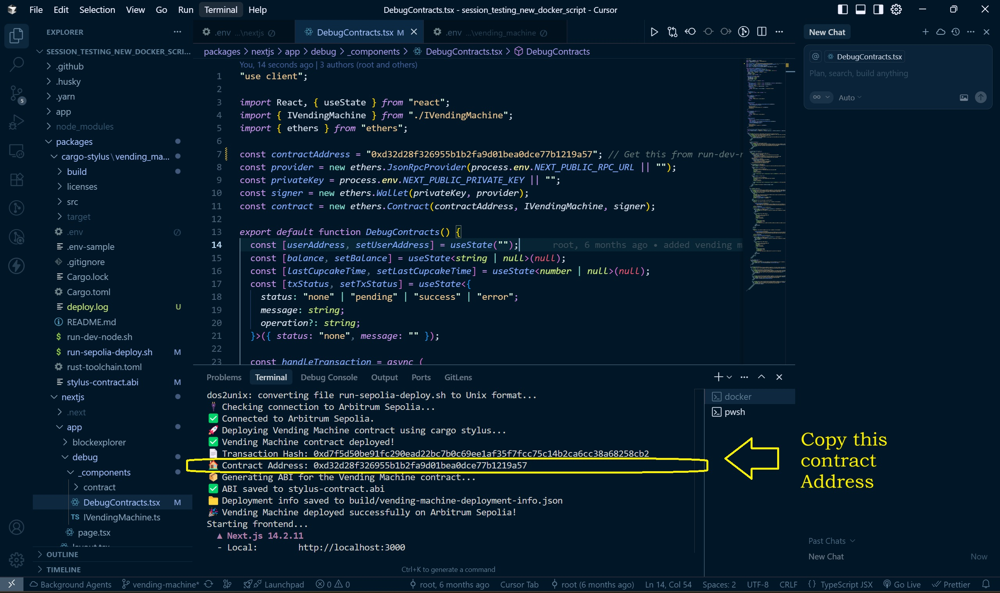
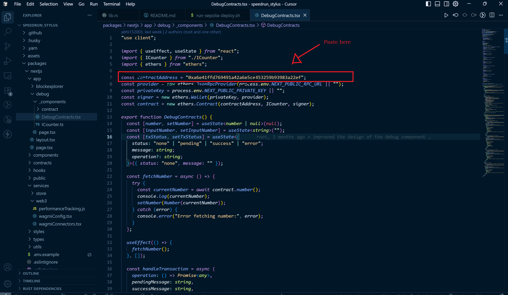
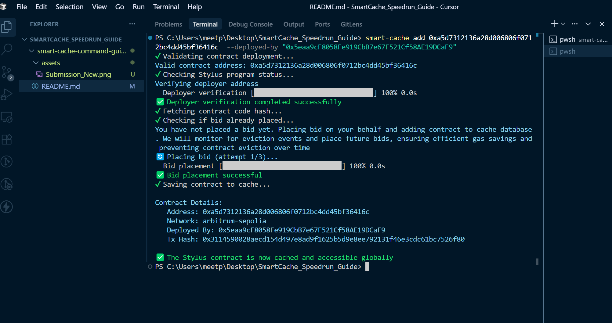

# Using Docker for Speedrun Stylus Project (Arbitrum Sepolia Deployment)

> **Before you begin:** For each challenge, you must first create a folder on your Desktop, open that folder in Cursor IDE, and then clone the project into it. This ensures a clean workspace for every challenge.

## Prerequisites
- **Docker Installed**:
  - **Ubuntu**: Install Docker Engine with `sudo apt update && sudo apt install docker.io` (or follow [official docs](https://docs.docker.com/engine/install/ubuntu/)).
  - **Windows**: Install Docker Desktop from [docker.com](https://www.docker.com/products/docker-desktop/). Ensure it's running and configured (e.g., enable WSL2 backend if using WSL).
- Git installed on your host machine for cloning the repo.
- An Ethereum wallet with Arbitrum Sepolia testnet ETH (get from a faucet like [Arbitrum's official faucet](https://faucet.arbitrum.io/)).
- Your wallet's private key (prefixed with `0x`) for the `.env` file—**never commit this to Git or share publicly**.

## Clone the Repository for Your Challenge
Choose the appropriate command below for your challenge:

- **Counter Challenge:**
  ```
  git clone --single-branch -b counter https://github.com/abhi152003/speedrun_stylus.git ./
  ```
- **NFT Challenge:**
  ```
  git clone --single-branch -b nft https://github.com/abhi152003/speedrun_stylus.git ./
  ```
- **Vending Machine Challenge:**
  ```
  git clone --single-branch -b vending-machine https://github.com/abhi152003/speedrun_stylus.git ./
  ```
- **Multisig Wallet Challenge:**
  ```
  git clone --single-branch -b multi-sig https://github.com/abhi152003/speedrun_stylus.git ./
  ```
- **Uniswap V2 Challenge:**
  ```
  git clone --single-branch -b stylus-uniswap https://github.com/abhi152003/speedrun_stylus.git ./
  ```

After cloning, open the project folder in Cursor IDE to continue with the setup.

This guide explains how to use a pre-built Docker image to set up and deploy the Speedrun Stylus project to the Arbitrum Sepolia testnet. The Docker image includes all necessary dependencies (Node.js, Yarn, Rust with nightly toolchain and rust-src, cargo-stylus, Foundry, etc.), so you don't need to install them manually. This is tailored for deploying via `run-sepolia-deploy.sh` and running the frontend.

## General Steps (Common to both Windows/Ubuntu Users)
1. **Pull the Docker Image**:
   ```
   docker pull abxglia/speedrun-stylus-sepolia:0.1
   ```

## Steps for Users

Before running the Docker container, make sure you have pulled the image and cloned the correct branch for your challenge.

> **Note:** When setting your private key in any .env file, append your private key with `0x` (e.g., `0xabc123...`).

### 1. Set up environment variables (done inside the Docker container)

#### For the Counter Challenge
- In the container, navigate to `packages/nextjs`:
  ```
  cd packages/nextjs
  cp .env.example .env
  ```
- Edit `.env` and set:
  ```
  NEXT_PUBLIC_RPC_URL=https://sepolia-rollup.arbitrum.io/rpc
  NEXT_PUBLIC_PRIVATE_KEY=0xYourPrivateKeyHere  # Append your private key with 0x (MetaMask private keys do not include it by default)
  ```
- Then, navigate to `packages/stylus-demo`:
  ```
  cd ../stylus-demo
  touch .env
  echo "PRIVATE_KEY=0xYourPrivateKeyHere" > .env  # Append your private key with 0x (MetaMask private keys do not include it by default)
  ```

#### For NFT, Vending Machine, Multisig, and Uniswap Challenges
- In the container, navigate to `packages/nextjs`:
  ```
  cd packages/nextjs
  cp .env.example .env
  ```
- Edit `.env` 
  ```
  NEXT_PUBLIC_RPC_URL=https://sepolia-rollup.arbitrum.io/rpc
  NEXT_PUBLIC_PRIVATE_KEY=0xYourPrivateKeyHere  # Append your private key with 0x (MetaMask private keys do not include it by default)
  ```
- Then, navigate to the appropriate folder in `packages/cargo-stylus/` (replace `<challenge-folder>` with `nft`, `vending_machine`, `multi-sig`, or `stylus-uniswap-v2`):
  ```
  cd ../cargo-stylus/<challenge-folder>
  touch .env
  echo "PRIVATE_KEY=0xYourPrivateKeyHere" > .env  # Append your private key with 0x (MetaMask private keys do not include it by default)
  ```

---

> **Important:** Before running the Docker commands below, make sure you are in the **root directory** of your project (the folder where you cloned the repository). If you have previously navigated into a subdirectory (such as `packages/nextjs`, `packages/stylus-demo`, or any `cargo-stylus` folder), move back to the root directory using `cd ..` or the appropriate number of `cd ..` commands until you are at the project root. This ensures Docker mounts the correct folder.

---

1. **Run the Docker Container** (replace `<project-folder>` with your cloned project name, e.g., `counter`, `nft`, `vending_machine`, `stylus-uniswap-v2`, `multi-sig`):
   - **Ubuntu:**
     ```
     docker run -it \
         -v $(pwd):/app \
         -p 3000:3000 \
         abxglia/speedrun-stylus-sepolia:0.1 <project-folder>
     ```
   - **Windows (PowerShell):**
     ```
     docker run -it `
         -v ${PWD}:/app `
         -p 3000:3000 `
         abxglia/speedrun-stylus-sepolia:0.1 counter
     ```
     Or as a single line:
     ```
     docker run -it -v ${PWD}:/app -p 3000:3000 abxglia/speedrun-stylus-sepolia:0.1 counter
     ```

Replace `<project-folder>` with the name of the folder you cloned for your challenge (e.g., `counter`, `nft`, `vending_machine`, `stylus-uniswap-v2`, `multi-sig`).

2. **Inside the Container**:
   - (Contract deployment and frontend startup will be handled automatically inside the Docker container. Once deployed, the contract address and the frontend access link (e.g., http://localhost:3000) will be displayed in the container output. You do not need to run 'yarn run dev' yourself.)

---

### ⚠️ Contract Address Setup (Required for All Users)
Now **copy the contract address** from the bash terminal output. You will need to paste this address into the `contractAddress` variable in the `DebugContract` component. You will find the contract address in the Docker container's terminal once the contract has been successfully deployed, or in your terminal if you are using Docker Engine on Ubuntu.

> 💡 **Note:** This step is required for both Ubuntu and Windows users, and for all Speedrun challenges—always update the contract address in `DebugContracts.tsx` after deployment.

**Step 1: Copy the contract address from the Docker terminal:**

<p align="center"><em>Copy the contract address from the Docker terminal output</em></p>

**Step 2: Paste the contract address in the appropriate file:**
- For most challenges, open `/app/packages/nextjs/app/debug/DebugContracts.tsx` and replace the value of `contractAddress` with your new address.
- **For the stylus-uniswap-v2 challenge:** Open `/app/packages/nextjs/app/debug/_components/UniswapInterface.tsx` and replace the contract address in the `uniswapContractAddress` variable, as this challenge does not have a `DebugContracts.tsx` file.

<p align="center"><em>Paste the copied contract address in the appropriate file as described above</em></p>

---

## ⚡️ Cache Your Deployed Contract for Faster, Cheaper Access

> **This is a necessary step before pushing your code to GitHub. Please make sure to cache your deployed contract as described below before proceeding to the submission steps.**

> 📖 Contracts deployed on Arbitrum Sepolia can use this command for gas benefits, time savings, and cheaper contract function calls. Our backend will benchmark and place bids on your behalf to ensure your contract is not evicted from the CacheManager contract, fully automating this process for you.

Before caching your contract, make sure you have installed the Smart Cache CLI globally:

```bash
npm install -g smart-cache-cli
```

> 💡 **Info:** Both the `<address>` and `--deployed-by` flags are **mandatory** when adding a contract to the cache. The wallet address for `--deployed-by` should be the one whose private key you added in `packages/nextjs/.env`.

### 📝 Simple Example

```bash
smart-cache add <CONTRACT_ADDRESS> --deployed-by <YOUR_WALLET_ADDRESS_WITH_WHOM_YOU_HAVE_DEPLOYED_CONTRACT>
```


<p align="center"><em>This is what you should see in your terminal if the smart-cache add command works successfully.</em></p>

---

## 🚀 Submitting Your Challenge

After you have completed the setup and are ready to submit your solution, follow these steps:

1. **Create a New GitHub Repository**

   - Go to [GitHub](https://github.com/) and create a new repository (public or private as required by the challenge).

2. **Set Your Local Repository's Remote URL**

   - In your project directory, update the remote URL to your new repository:
     ```bash
     git remote set-url origin https://github.com/yourusername/your-repo.git
     ```

3. **Push Your Code to GitHub**

   - Add and commit any changes if you haven't already:
     ```bash
     git add .
     git commit -m "Initial commit for challenge submission"
     ```
   - Push your code:
     ```bash
     git push -u origin counter
     ```

4. **Submit Your Challenge**
   - Copy your repository link in the following format (without `.git` at the end):
     ```
     https://github.com/yourusername/your-repo
     ```
   - Use this link to submit your challenge as instructed.

---
