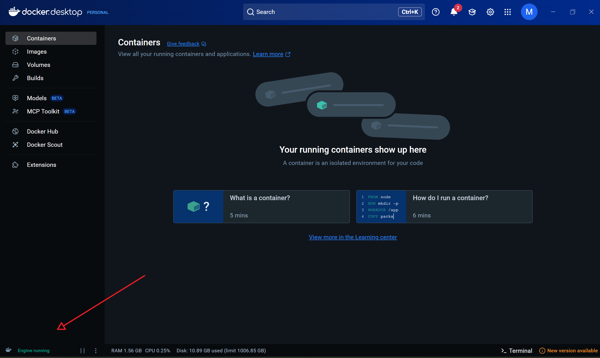
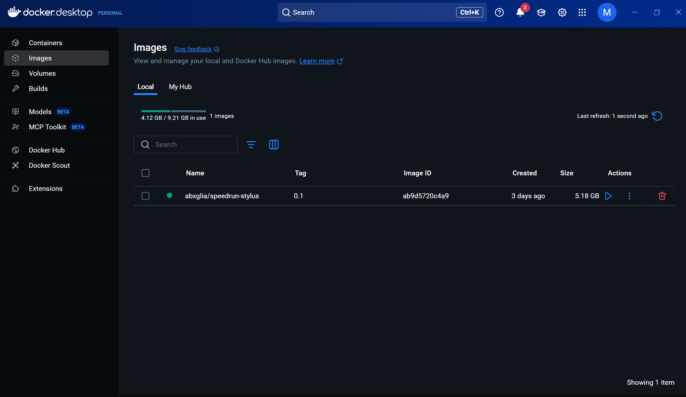
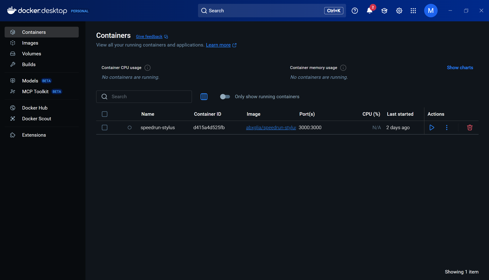
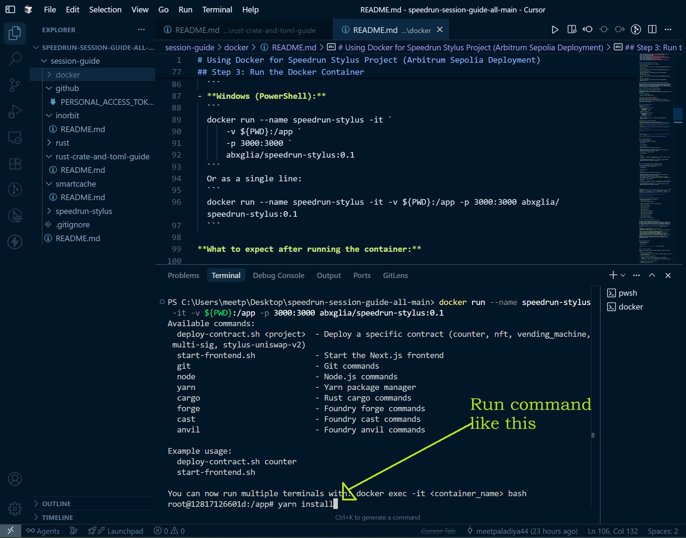
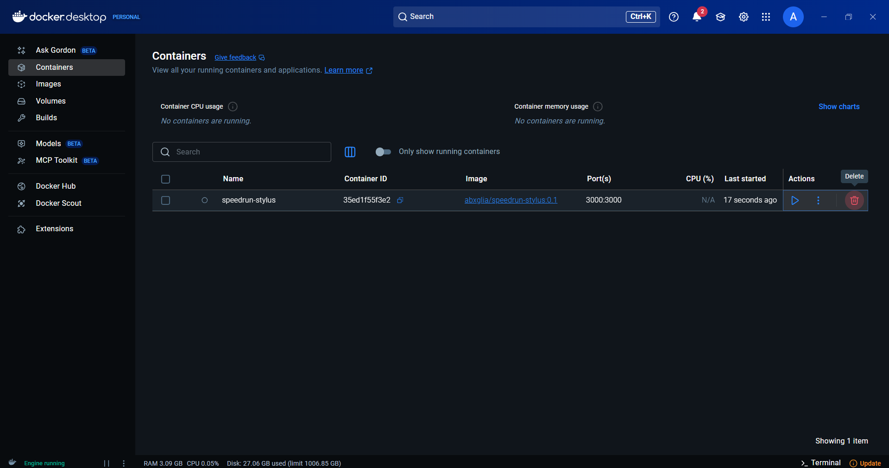

# Using Docker for Speedrun Stylus Project (Arbitrum Sepolia Deployment)

> **Before you begin:** For each challenge, you must first create a folder on your Desktop, open that folder in Cursor IDE, and then clone the project into it. This ensures a clean workspace for every challenge.

## Prerequisites

- **Docker Installed**:
  - **Ubuntu**: Install Docker Engine with `sudo apt update && sudo apt install docker.io` (or follow [official docs](https://docs.docker.com/engine/install/ubuntu/)).
  - **Windows**: Install Docker Desktop from [docker.com](https://www.docker.com/products/docker-desktop/). Ensure it's running and configured (e.g., enable WSL2 backend if using WSL).
- Git installed on your host machine for cloning the repo.
- An Ethereum wallet with Arbitrum Sepolia testnet ETH (get from a faucet like [Arbitrum Sepolia Faucet](https://faucet.lamprosdao.com/)).
- Your wallet's private key (prefixed with `0x`) for the `.env` file—**never commit this to Git or share publicly**.

## 📋 Quick Navigation

- [Step 1: Clone the Repository for Your Challenge](#step-1-clone-the-repository-for-your-challenge)
- [Step 2: General Steps](#step-2-general-steps-common-to-both-windowsubuntu-users)
- [Step 3: Run the Docker Container](#step-3-run-the-docker-container)
- [Step 4: Set up Environment Variables](#step-4-set-up-environment-variables-done-inside-the-docker-container)
- [Step 5: Deploy the Contract](#step-5-deploy-the-contract-required-for-all-users)
- [Step 6: Contract Address Setup](#step-6-contract-address-setup-required-for-all-users)
- [Step 7: Start the Frontend](#step-7-start-the-frontend)
- [Step 8: Submit Your Challenge](#step-8-submit-your-challenge)
- [Step 9: Additional Submissions](#step-9-additional-submissions-2nd-and-3rd-time)

---

## Step 1: Clone the Repository for Your Challenge

Choose the appropriate command below for your challenge:

- **Counter Challenge:**
  ```
  git clone --single-branch -b counter https://github.com/abhi152003/speedrun_stylus.git ./
  ```
- **NFT Challenge:**
  ```
  git clone --single-branch -b nft https://github.com/abhi152003/speedrun_stylus.git ./
  ```
- **Vending Machine Challenge:**
  ```
  git clone --single-branch -b vending-machine https://github.com/abhi152003/speedrun_stylus.git ./
  ```
- **Multisig Wallet Challenge:**
  ```
  git clone --single-branch -b multi-sig https://github.com/abhi152003/speedrun_stylus.git ./
  ```
- **Uniswap V2 Challenge:**
  ```
  git clone --single-branch -b stylus-uniswap https://github.com/abhi152003/speedrun_stylus.git ./
  ```

After cloning, open the project folder in Cursor IDE to continue with the setup.

This guide explains how to use a pre-built Docker image to set up and deploy the Speedrun Stylus project to the Arbitrum Sepolia testnet. The Docker image includes all necessary dependencies (Node.js, Yarn, Rust with nightly toolchain and rust-src, cargo-stylus, Foundry, etc.), so you don't need to install them manually. This is tailored for deploying via `run-sepolia-deploy.sh` and running the frontend.

## Step 2: General Steps (Common to both Windows/Ubuntu Users)

**Before you begin, ensure your Docker Engine is running:**



<p align="center"><em>Verify that "Engine running" is displayed in Docker Desktop's status bar</em></p>

1. **Pull the Docker Image**:
   ```
   docker pull abxglia/speedrun-stylus:0.1
   ```

**What to expect after pulling the Docker image:**



<p align="center"><em>Docker image successfully pulled and ready to use</em></p>

Before running the Docker container, make sure you have pulled the image and cloned the correct branch for your challenge.

---

## Step 3: Run the Docker Container

> **⚠️ IMPORTANT:** Before running this container, ensure that:
>
> - **Docker Desktop is running** (if using Windows/macOS)
> - **Docker Engine is running** (verify this in Docker Desktop's status bar - you should see "Engine running")

**Run the Docker Container:**

- **Ubuntu:**
  ```
  docker run --name speedrun-stylus -it \
      -v $(pwd):/app \
      -p 3000:3000 \
      abxglia/speedrun-stylus:0.1
  ```
- **Windows (PowerShell):**
  ```
  docker run --name speedrun-stylus -it `
      -v ${PWD}:/app `
      -p 3000:3000 `
      abxglia/speedrun-stylus:0.1
  ```
  Or as a single line:
  ```
  docker run --name speedrun-stylus -it -v ${PWD}:/app -p 3000:3000 abxglia/speedrun-stylus:0.1
  ```

**What to expect after running the container:**



<p align="center"><em>Docker container running successfully in Docker Desktop</em></p>

> **Note:** Once the container is running, you'll see a terminal prompt inside the container where you can execute the commands for the next steps.

---

## ⚠️ **MANDATORY STEP: Run Yarn Install**

**🚨 THIS STEP IS REQUIRED - DO NOT SKIP!**

After the container is running and you see the terminal prompt inside the container, you **MUST** run the following command:

```bash
yarn install
```

**What to expect when running yarn install:**



<p align="center"><em>Terminal output showing the yarn install process and available commands inside the Docker container</em></p>

## Step 4: Set up Environment Variables (done inside the Docker container)

> **⚠️ Important:** This step installs all necessary dependencies for your project. Without running `yarn install`, the subsequent steps will fail. Make sure you see the installation complete successfully before proceeding to the next steps.

---

> **Important:** If you are working on a new challenge and port 3000 is already in use by a previous container, you need to free up the port first. Open a new terminal and run:
>
> ```
> docker rm -f speedrun-stylus
> ```
>
> This will stop and remove the existing container, freeing up port 3000 for your new container to run.

> **Note:** When setting your private key in any .env file, append your private key with `0x` (e.g., `0xabc123...`).

---

### 🔢 **COUNTER CHALLENGE ONLY**

#### For the Counter Challenge

- In the container, navigate to `packages/nextjs`:
  ```
  cd packages/nextjs
  ```
  ```
  cp .env.example .env
  ```
- Edit `.env` and set:
  ```
  NEXT_PUBLIC_RPC_URL=https://sepolia-rollup.arbitrum.io/rpc
  ```
  ```
  NEXT_PUBLIC_PRIVATE_KEY=0xYourPrivateKeyHere  # Append your private key with 0x (MetaMask private keys do not include it by default)
  ```
- Then, navigate to `packages/stylus-demo`:
  ```
  cd ../stylus-demo
  ```
  ```
  touch .env
  ```
  > **Note:** If the `touch .env` command fails, you can create the `.env` file manually in your IDE by navigating to the `packages/stylus-demo` folder and creating a new file named `.env`.
  ```
  echo "PRIVATE_KEY=0xYourPrivateKeyHere" > .env  # Append your private key with 0x (MetaMask private keys do not include it by default)
  ```

---

### 🎨 **NFT, VENDING MACHINE, MULTISIG, AND UNISWAP CHALLENGES**

#### For NFT, Vending Machine, Multisig, and Uniswap Challenges

- In the container, navigate to `packages/nextjs`:
  ```
  cd packages/nextjs
  ```
  ```
  cp .env.example .env
  ```
- Edit `.env`
  ```
  NEXT_PUBLIC_RPC_URL=https://sepolia-rollup.arbitrum.io/rpc
  ```
  ```
  NEXT_PUBLIC_PRIVATE_KEY=0xYourPrivateKeyHere  # Append your private key with 0x (MetaMask private keys do not include it by default)
  ```
- Then, navigate to the appropriate folder in `packages/cargo-stylus/` (replace `<challenge-folder>` with `nft`, `vending_machine`, `multi-sig`, or `stylus-uniswap-v2`):
  ```
  cd ../cargo-stylus/<challenge-folder>
  touch .env
  ```
  > **Note:** If the `touch .env` command fails, you can create the `.env` file manually in your IDE by navigating to the appropriate `packages/cargo-stylus/<challenge-folder>` folder and creating a new file named `.env`.
  ```
  echo "PRIVATE_KEY=0xYourPrivateKeyHere" > .env  # Append your private key with 0x (MetaMask private keys do not include it by default)
  ```

---

---

> **Important:** Before running the below given commands, make sure you are in the **root directory** of your project (the folder where you cloned the repository). If you have previously navigated into a subdirectory (such as `packages/nextjs`, `packages/stylus-demo`, or any `cargo-stylus` folder), move back to the root directory using `cd ..` or the appropriate number of `cd ..` commands until you are at the project root. This ensures Docker mounts the correct folder.
> OR
> You can open up a new terminal in the VS code and run this command :
>
> ```
> docker exec -it speedrun-stylus bash
> ```

## Step 5: Deploy the Contract (Required for All Users)

⚠️ **Deploy the Contract (Required for All Users)**

- In the container terminal :

  ```
     deploy-contract.sh <challenge-name>
  ```

  **Replace `<challenge-name>` with your specific challenge:**

  - **For Counter Challenge:**
    ```
    deploy-contract.sh counter
    ```
  - **For NFT Challenge:**
    ```
    deploy-contract.sh nft
    ```
  - **For Vending Machine Challenge:**
    ```
    deploy-contract.sh vending_machine
    ```
  - **For Multisig Wallet Challenge:**
    ```
    deploy-contract.sh multi-sig
    ```
  - **For Uniswap V2 Challenge:**
    ```
    deploy-contract.sh stylus-uniswap-v2
    ```

## Step 6: Contract Address Setup (Required for All Users)

⚠️ **Contract Address Setup (Required for All Users)**
Now **copy the contract address** from the bash terminal output. You will need to paste this address into the `contractAddress` variable in the `DebugContract` component. You will find the contract address in the Docker container's terminal once the contract has been successfully deployed, or in your terminal if you are using Docker Engine on Ubuntu.

> 💡 **Note:** This step is required for both Ubuntu and Windows users, and for all Speedrun challenges—always update the contract address in `DebugContracts.tsx` after deployment.

**Step 1: Copy the contract address from the Docker terminal:**


<p align="center"><em>Copy the contract address from the Docker terminal output</em></p>

**Step 2: Paste the contract address in the appropriate file:**

- For most challenges, open `/app/packages/nextjs/app/debug/DebugContracts.tsx` and replace the value of `contractAddress` with your new address.
- **For the stylus-uniswap-v2 challenge:** Open `/app/packages/nextjs/app/debug/_components/UniswapInterface.tsx` and replace the contract address in the `uniswapContractAddress` variable, as this challenge does not have a `DebugContracts.tsx` file.

<p align="center"><em>Paste the copied contract address in the appropriate file as described above</em></p>

---

## Step 7: Start the Frontend

**Start the Frontend**

- In the container terminal:
  ```
  start-frontend.sh
  ```

> **Note:** The frontend will be accessible at `http://localhost:3000/`.

---

## Step 8: Submit Your Challenge

After you have completed the setup and are ready to submit your solution, follow these steps:

1. **Create a New GitHub Repository**

   - Go to [GitHub](https://github.com/) and create a new repository (public or private as required by the challenge).

2. **Set Your Local Repository's Remote URL**

   - In your project directory, update the remote URL to your new repository:
     ```bash
     git remote set-url origin https://YOUR_TOKEN@github.com/yourusername/your-repo.git
     ```

3. **Set your github username and email address:**

   ```bash
   git config user.name "yourusername"
   ```

   ```
   git config user.email "youremail@example.com"
   ```

   Verify it by running this commands

   ```
   git config user.name
   ```

   ```
   git config user.email
   ```

4. **Push Your Code to GitHub**

   - Add and commit any changes if you haven't already:
     ```bash
     git add .
     ```
     ```
     git commit -m "Initial commit for challenge submission"
     ```
   - Push your code:
     ```bash
     git push -u origin counter
     ```

5. **Submit Your Challenge**
   - Copy your repository link in the following format (without `.git` at the end):
     ```
     https://github.com/yourusername/your-repo
     ```
   - Use this link to submit your challenge as instructed.

---

## Step 9: Additional Submissions (2nd and 3rd Time)

After your first submission, you need to submit the same challenge **2 more times** on the speedrun platform. For these additional submissions, you need to follow the **Smart Cache Script** steps mentioned in the [rust-crate-and-toml-guide README](https://github.com/purvik6062/session-guide/blob/main/rust-crate-and-toml-guide/README.md).

> **Important**: These additional steps are necessary to complete the full speedrun challenge requirements and demonstrate your understanding of smart caching optimization.

---

### Note : Make sure to delete the container before moving on to the next challenge as we can't have multiple containers with the same name.


