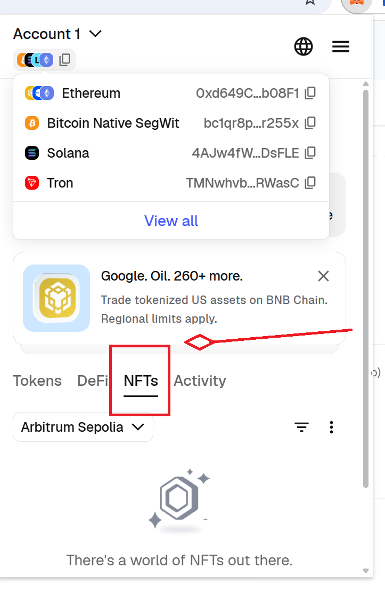
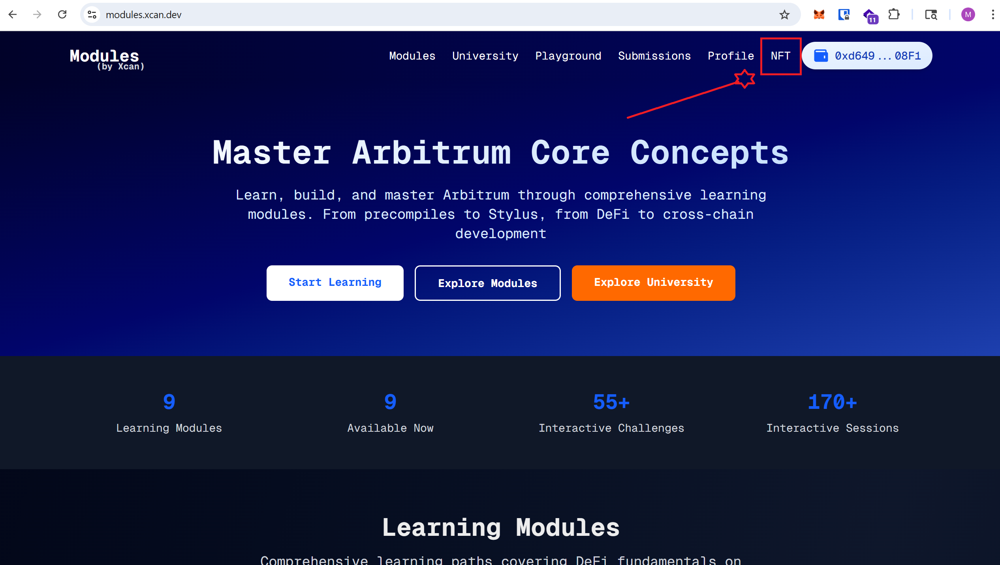
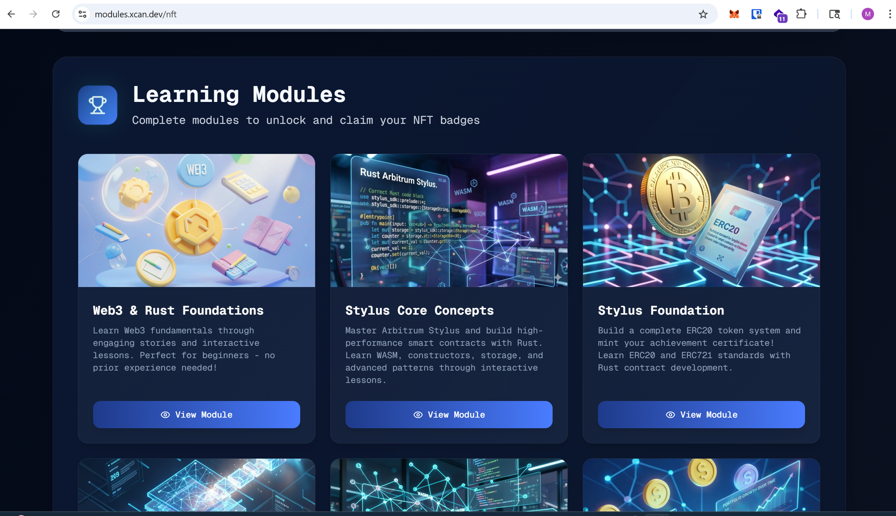
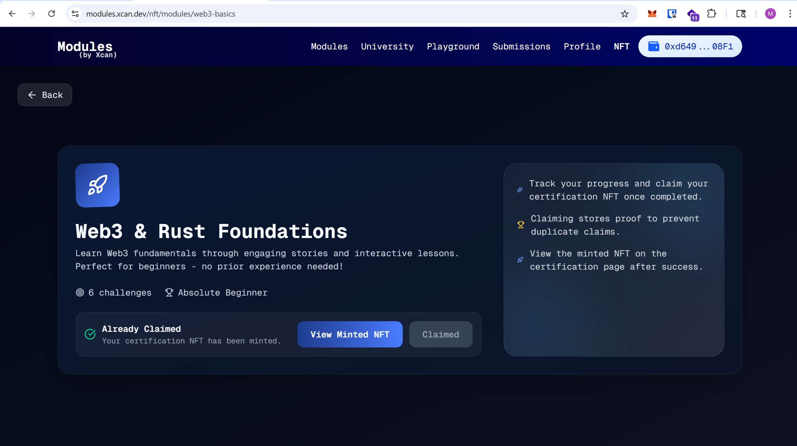
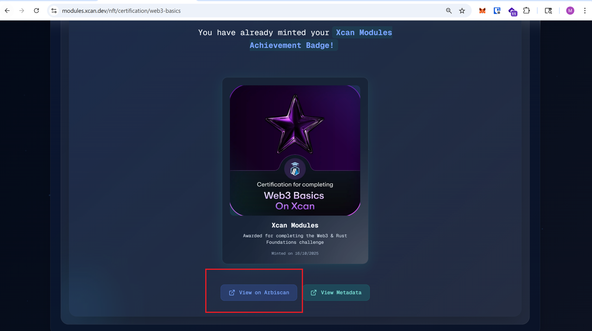
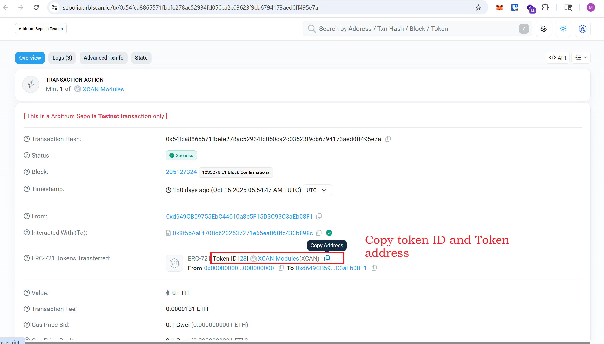
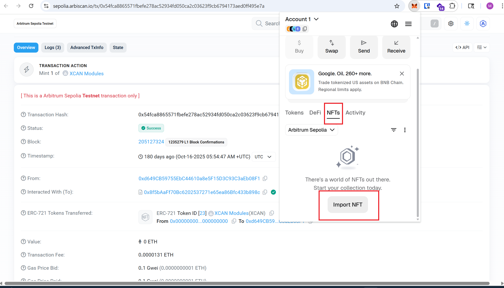
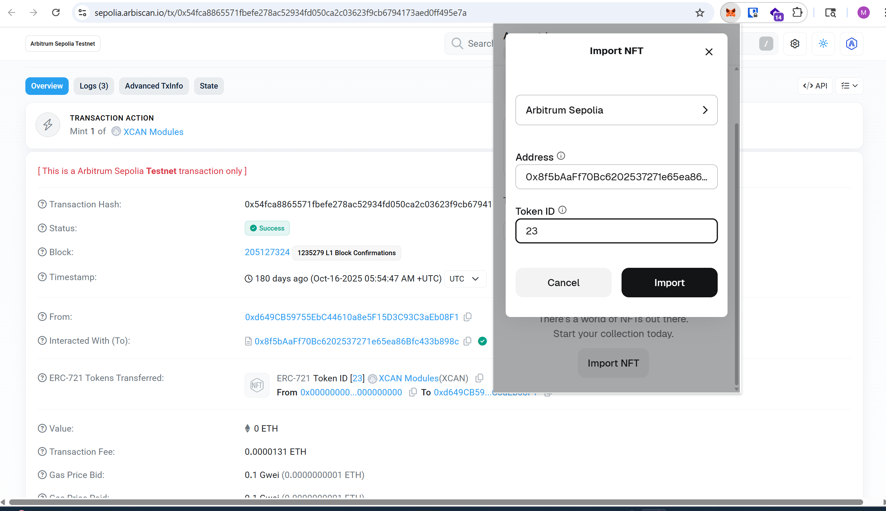
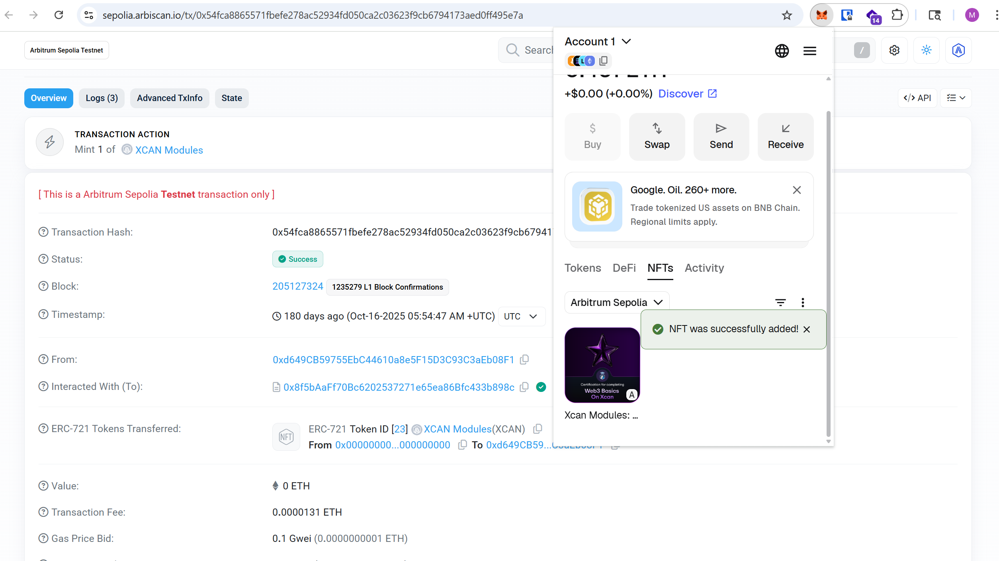

# NFT Visibility and Manual Import Guide (MetaMask)

Use this guide if you have already claimed a Modules NFT certificate, but the NFT is not visible in your MetaMask wallet.

## When to use this

- First, check whether your NFT is already visible in MetaMask.
- Only follow the manual import steps if the NFT is missing from the `NFTs` tab.

## Step-by-step guide

### 1) Check NFTs in MetaMask first

Click the MetaMask extension, then open the third tab: `NFTs`.  
If your module NFT is not visible there, continue with the next steps.

### 2) Open the NFT section on Modules

Go to the `NFT` tab on `modules.xcan.dev`.  
You will be redirected to:

`https://modules.xcan.dev/nft`

### 3) Open the completed module card

Find the module you completed whose NFT is missing in MetaMask.  
Example shown: `Web3 & Rust Foundations`.  
Click the module card button (`View Module`) for that module.

### 4) Click “View Minted NFT”

After completing the module and claiming the certificate, click `View Minted NFT`.

### 5) Open Arbiscan from certificate page

Scroll down and click `View on Arbiscan`.

### 6) Copy contract address and token ID

On Arbiscan, copy:

- ERC-721 contract address (`Interacted With (To)`)
- ERC-721 token ID

You will need both values in MetaMask while importing the NFT.

### 7) Open Import NFT in MetaMask

Back in MetaMask:

- Go to the `NFTs` tab
- Click `Import NFT`

Use this when the minted NFT is still not visible automatically.

### 8) Paste details and import

In the import form:

- Select `Arbitrum Sepolia` (or the similarly named Arbitrum Sepolia network available in your wallet)
- Paste the contract address
- Paste the token ID
- Click `Import`

### 9) Confirm NFT is added

You should see a success message (`NFT was successfully added!`) and the NFT card will appear in your MetaMask `NFTs` tab.

---

## Quick troubleshooting

- Ensure you are on the correct network (`Arbitrum Sepolia`) in MetaMask.
- Double-check both contract address and token ID from Arbiscan.
- If it still does not appear, close/reopen the extension and check the `NFTs` tab again.
