### Option 2: Sign in with Secret Recovery Phrase (SRP)

1. Click on Continue with Secret Recovery Phrase button.

   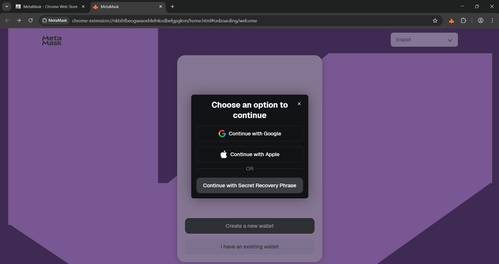

2. Reveal the SRP and store it offline in a safe place by clicking on "Tap to reveal" text. Do not share it with anyone. You can take a screenshot/picture of the SRP to store it offline or else you can write it down on a piece of paper.

   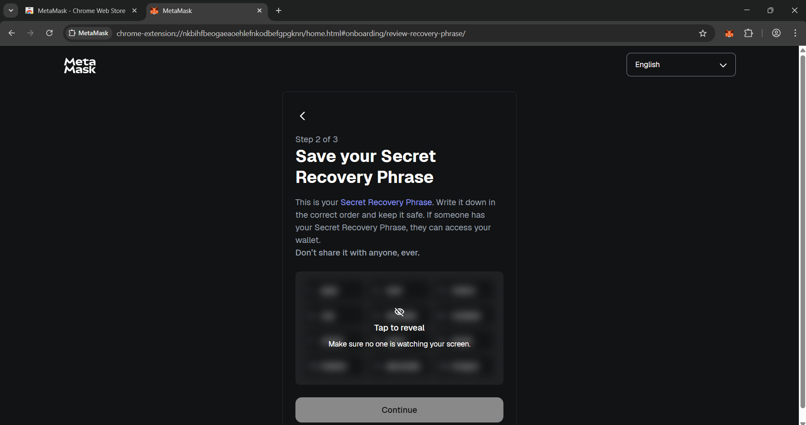

   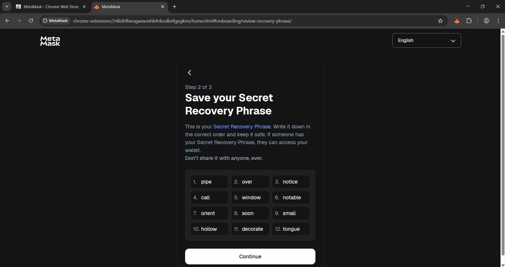

***Note : Make sure you stored the SRP in the correct order as it will be used in the next step to confirm the SRP.***

3. Confirm your SRP to finish wallet setup by clicking the missing words in the order of the SRP.

   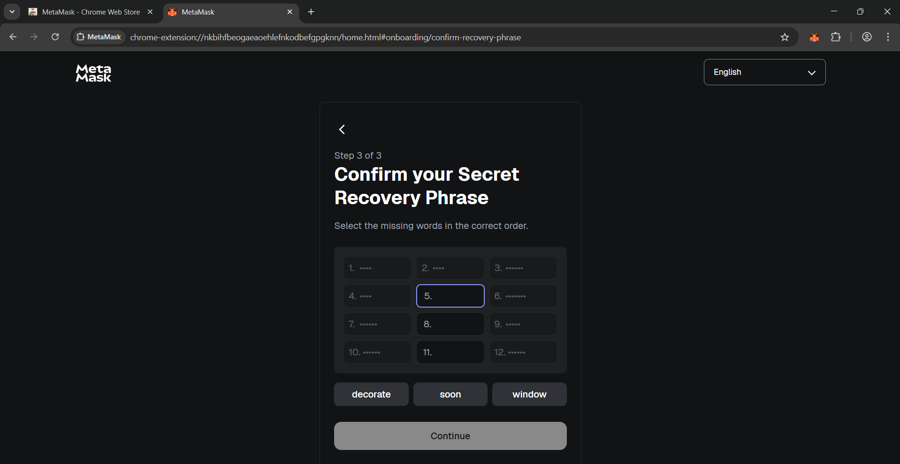

4. Help improve MetaMask by sharing usage data (optional).

   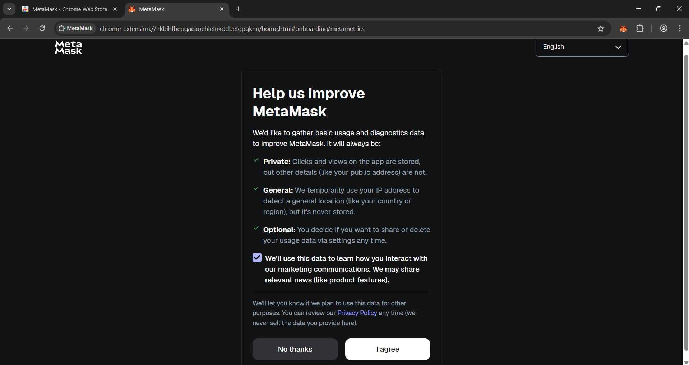

5. You should see a completion screen. Click Done.

   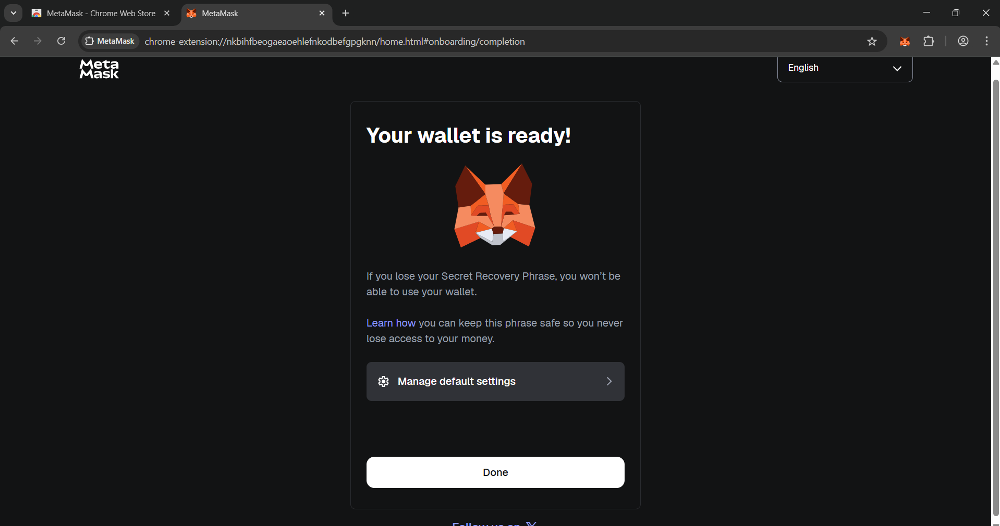

Optional: If prompted with non-EVM content (e.g., Solana), ignore or close it; MetaMask here is used for EVM chains like Arbitrum.

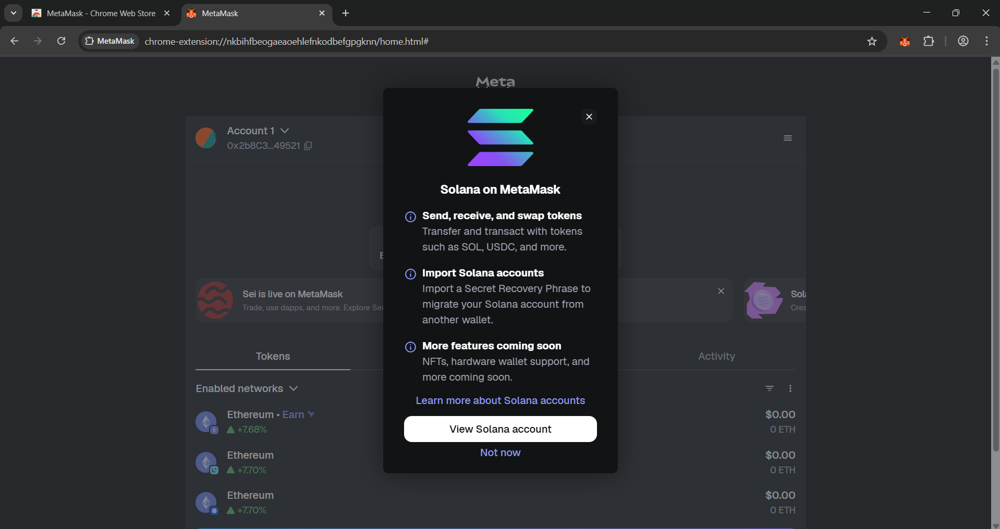

---

### If you want to view your Secret Recovery Phrase (SRP)

1. Click on the down arrow placed after the account name.

   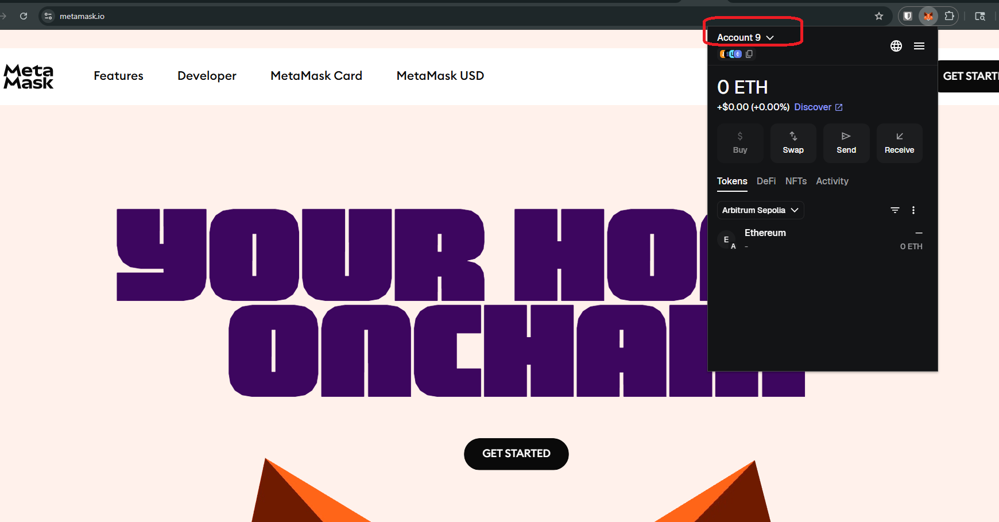

2. Click on the first option **Account details**.

   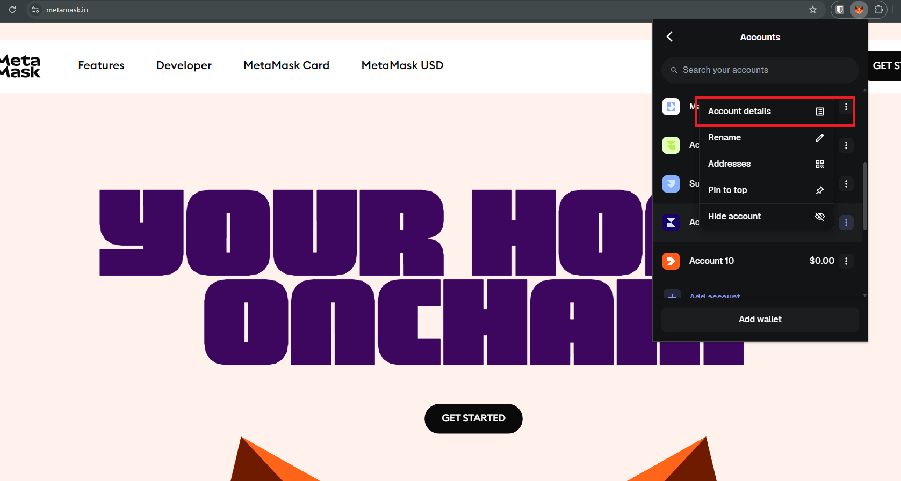

3. Click on the last option **Secret Recovery Phrase**.

   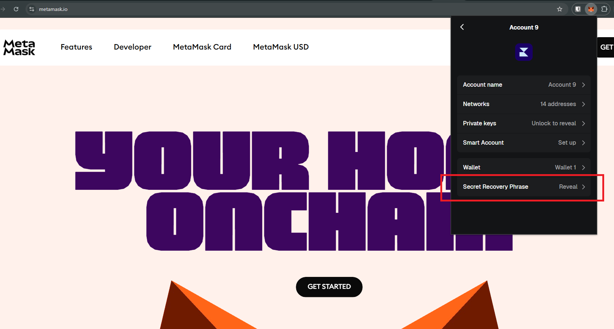

4. Click on the **Get started** button.

   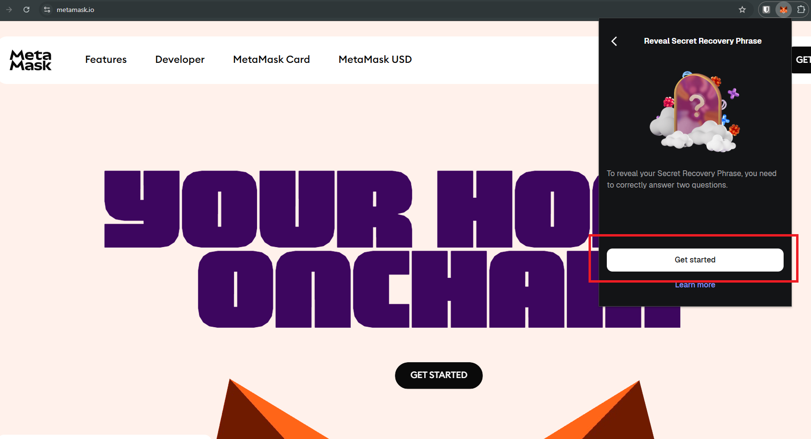

5. Then answer 2 questions. You must answer correctly to proceed and view SRP.

   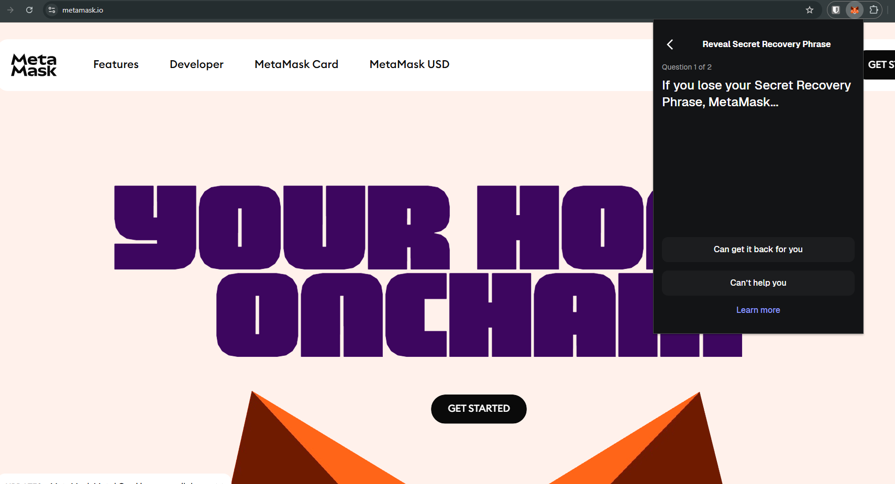

6. After answering correctly, click on the **Continue** button.

   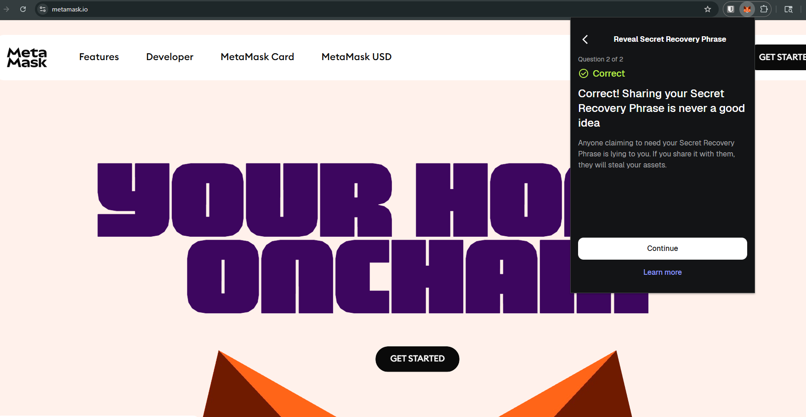

7. Enter your MetaMask wallet password.

   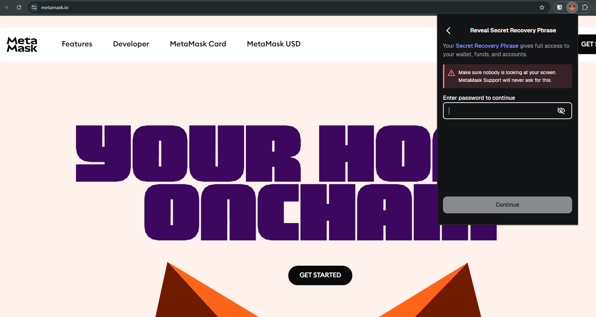

8. Click on the **Tap to reveal** button. Make sure no one is watching your screen.

   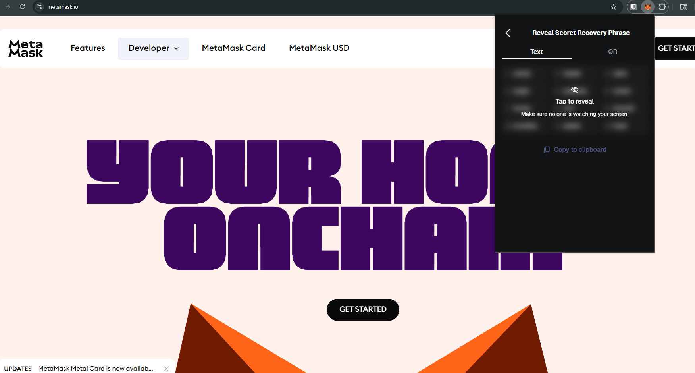

🔴 [Caution: Never share your Secret Recovery Phrase with anyone.]